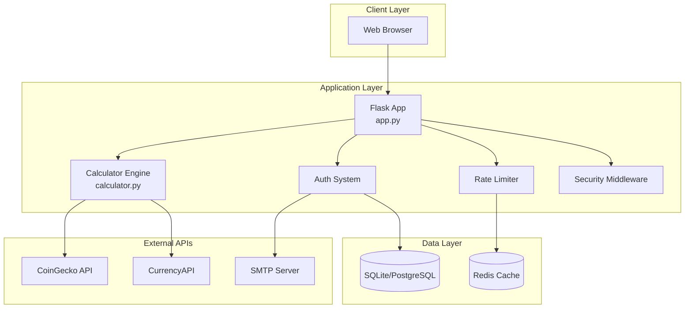
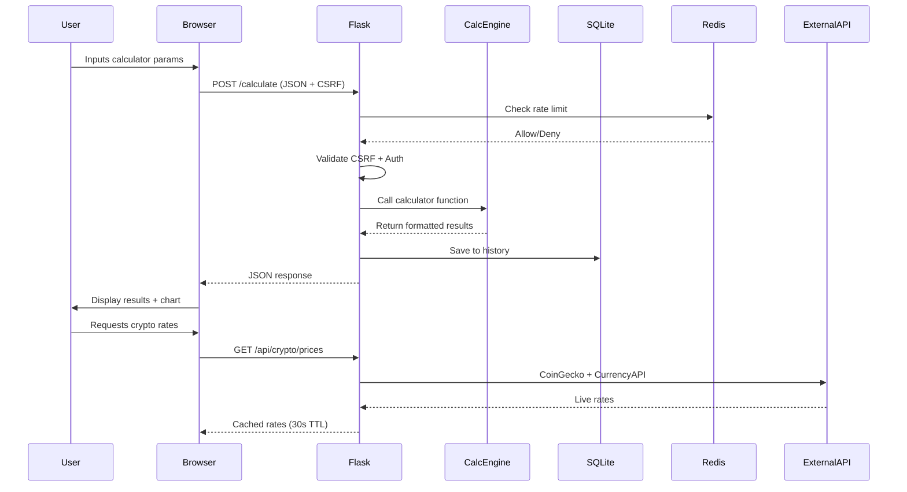

# Software Requirements Specification (SRS)

## FinCalc Pro — Smart Financial Calculators for India

**Version:** 2.0  
**Date:** October 8, 2026  
**Status:** Approved  
**Classification:** Public  

---

## Table of Contents

1. [Introduction](#1-introduction)
2. [Overall Description](#2-overall-description)
3. [Functional Requirements](#3-functional-requirements)
4. [Non-Functional Requirements](#4-non-functional-requirements)
5. [System Architecture](#5-system-architecture)
6. [Data Requirements](#6-data-requirements)
7. [Interface Requirements](#7-interface-requirements)
8. [Security Requirements](#8-security-requirements)
9. [Testing Requirements](#9-testing-requirements)
10. [Appendices](#10-appendices)

---

## 1. Introduction

### 1.1 Purpose

This Software Requirements Specification (SRS) defines the functional and non-functional requirements for **FinCalc Pro**, a modern, full-stack financial calculator web application built for Indian financial planning. The document serves as the single source of truth for developers, QA engineers, product managers, and stakeholders.

### 1.2 Scope

FinCalc Pro provides **25+ financial calculators** tailored for Indian users, covering:
- Investment planning (SIP, Lumpsum, PPF, EPF, NPS, NSC, FD, RD)
- Retirement & goal planning
- Loan & EMI calculations (Home, Car, Gold, Education)
- General finance (GST, Gratuity, Salary breakdown, Brokerage)
- Cryptocurrency conversion (100+ coins, real-time rates)

The application includes a complete authentication system, calculation history, responsive UI with 5 themes, PDF export, and Chart.js visualizations.

### 1.3 Definitions, Acronyms, and Abbreviations

| Term | Definition |
|------|------------|
| **SIP** | Systematic Investment Plan |
| **EMI** | Equated Monthly Installment |
| **PPF** | Public Provident Fund |
| **EPF** | Employees' Provident Fund |
| **NPS** | National Pension System |
| **NSC** | National Savings Certificate |
| **FD** | Fixed Deposit |
| **RD** | Recurring Deposit |
| **CAGR** | Compound Annual Growth Rate |
| **GST** | Goods and Services Tax |
| **KYC** | Know Your Customer |
| **PBKDF2** | Password-Based Key Derivation Function 2 |
| **CSRF** | Cross-Site Request Forgery |
| **CSP** | Content Security Policy |
| **HSTS** | HTTP Strict Transport Security |
| **SLA** | Service Level Agreement |

### 1.4 References

- [SECURITY_AUDIT_REPORT.md](../SECURITY_AUDIT_REPORT.md) — 18 security issues resolved
- [RESPONSIVE_TEST_REPORT.md](../RESPONSIVE_TEST_REPORT.md) — 45/45 tests pass
- [QA_CODEBASE_CLEANUP_REPORT.md](../QA_CODEBASE_CLEANUP_REPORT.md) — Code quality analysis
- [FINAL_ENGINEERING_AUDIT_REPORT.md](../FINAL_ENGINEERING_AUDIT_REPORT.md) — Overall PASS
- Indian Financial Formulas — Standard banking/government formulas
- OWASP Top 10 2021 — Security benchmark

### 1.5 Overview

The SRS is organized into functional requirements (Section 3), non-functional requirements (Section 4), and system architecture (Section 5). Each requirement is uniquely identified, prioritized, and traceable to test cases.

---

## 2. Overall Description

### 2.1 Product Perspective

FinCalc Pro is a standalone web application built with **Flask (Python)** backend and **Vanilla JavaScript** frontend. It follows a traditional server-rendered architecture with progressive enhancement via JavaScript for calculator interactions.

```
┌─────────────────────────────────────────────────────────────┐
│                        FinCalc Pro                          │
├─────────────────┬─────────────────┬─────────────────────────┤
│   Landing Page  │  Auth System    │  Calculator Engine      │
│   (Public)      │  (Register/     │  (25+ Calculators)      │
│                 │   Login/Email   │                         │
├─────────────────┼─────────────────┼─────────────────────────┤
│  Dashboard SPA  │  User Profile   │  History & Export       │
│  (Authenticated)│  (Avatar/PWD/   │  (PDF/Clipboard/Charts) │
│                 │   Delete Acct)  │                         │
└─────────────────┴─────────────────┴─────────────────────────┘
```

### 2.2 User Classes and Characteristics

| User Class | Description | Permissions |
|------------|-------------|-------------|
| **Anonymous Visitor** | Unauthenticated user browsing landing page | View landing page, access login/register |
| **Registered User** | Email-verified account holder | Full calculator access, history, profile management |
| **Admin (Future)** | System administrator | User management, analytics, system config |

### 2.3 Operating Environment

| Component | Technology | Version |
|-----------|------------|---------|
| **Backend** | Python Flask | 3.0+ |
| **Frontend** | Vanilla JavaScript | ES6+ |
| **Database** | SQLite (dev) / PostgreSQL (prod) | 3.x / 14+ |
| **ORM** | SQLAlchemy | 3.0+ |
| **WSGI Server** | Gunicorn | 21.2+ |
| **Styling** | CSS3 + CSS Variables | Native |
| **Charts** | Chart.js | 4.x via CDN |
| **PDF Export** | jsPDF + html2canvas | Latest via CDN |

### 2.4 Design and Implementation Constraints

| Constraint | Details |
|------------|---------|
| **Browser Support** | Chrome 90+, Firefox 88+, Safari 14+, Edge 90+ |
| **Device Support** | Mobile (320px+), Tablet (768px+), Desktop (1280px+) |
| **Accessibility** | WCAG 2.1 AA compliance |
| **Performance** | <3s load time, 60fps animations |
| **Security** | OWASP Top 10 compliance, zero critical/high vulns |
| **Deployment** | Render, Railway, Heroku, Docker compatible |
| **Data Privacy** | No PII stored beyond email/username; financial data not persisted |

### 2.5 Assumptions and Dependencies

| Assumption | Impact if False |
|------------|-----------------|
| Python 3.10+ available | Deployment fails |
| SMTP server for email | Verification/reset emails fail |
| CoinGecko API available | Crypto rates fallback to cached |
| CurrencyAPI key configured | USD/INR conversion unavailable |
| Redis in production | Rate limiting uses in-memory (per-worker) |

---

## 3. Functional Requirements

### 3.1 Authentication & User Management

| ID | Requirement | Priority | Description |
|----|-------------|----------|-------------|
| **FR-AUTH-01** | User Registration | HIGH | Register with username, email, password (9+ chars, letter, number, symbol) |
| **FR-AUTH-02** | Email Verification | HIGH | 1-hour expiring token sent via email; required before login |
| **FR-AUTH-03** | User Login | HIGH | Username + email + password; session creation with secure cookies |
| **FR-AUTH-04** | Session Management | HIGH | 24-hour timeout, HttpOnly, SameSite=Lax, Secure in prod |
| **FR-AUTH-05** | Logout | HIGH | Complete session invalidation |
| **FR-AUTH-06** | Password Reset | HIGH | Email-based reset with 1-hour token, complexity validation |
| **FR-AUTH-07** | Change Password | MEDIUM | In-session change with current password verification |
| **FR-AUTH-08** | Profile Picture | MEDIUM | Upload (JPG/PNG/WEBP/GIF, 2MB), magic byte validation, instant revert |
| **FR-AUTH-09** | Delete Account | MEDIUM | Two-step: password gate → email token → cascade delete (history, files, user) |
| **FR-AUTH-10** | Session Fixation Prevention | HIGH | Session cleared and regenerated on login |

#### FR-AUTH-01: User Registration - Detail

| Field | Validation Rules |
|-------|------------------|
| Username | 1-50 chars, alphanumeric + underscore, unique |
| Email | RFC 5322 format, max 100 chars, unique |
| Password | 9+ chars, ≥1 letter, ≥1 number, ≥1 symbol |
| Confirm Password | Must match password |

**Error Handling:** Generic messages prevent account enumeration. Duplicate unverified accounts allow resend.

---

### 3.2 Financial Calculators (25 Core)

All calculators share a common interface: **POST /calculate** with JSON `{type, params}` → returns `{success, data}`.

#### 3.2.1 Investment Calculators

| ID | Calculator | Function | Key Parameters | Formula Reference |
|----|------------|----------|----------------|-------------------|
| **FR-CALC-01** | SIP | `SIP(monthly, return%, years, mode)` | Monthly investment, expected return, duration, begin/end | FV = P × [((1+r)^n - 1)/r] × (1+r)^mode |
| **FR-CALC-02** | Lumpsum | `LUMPSUM(amount, return%, years)` | One-time investment, return, duration | FV = P(1+r)^n |
| **FR-CALC-03** | Step-Up SIP | `STEP_UP_SIP(monthly, step_up%, return%, years)` | Monthly SIP, annual step-up %, return, duration | Iterative monthly compounding with annual step-up |
| **FR-CALC-04** | SWP | `SWP(corpus, withdrawal, return%, years)` | Initial corpus, monthly withdrawal, return, duration | FV = P(1+r)^n - W × [((1+r)^n - 1)/r] × (1+r) |
| **FR-CALC-05** | PPF | `PPF(yearly, rate%, years)` | Annual investment, interest rate, duration (15yr default) | Maturity = P × [((1+r)^n - 1)/r] × (1+r) |
| **FR-CALC-06** | EPF | `EPF(basic, DA, years, salary_growth%, epf_rate%)` | Basic salary, DA, service years, growth rates | Monthly PF = 12% × (basic+DA); employer 12% split EPS/EPF |
| **FR-CALC-07** | NPS | `NPS(monthly, return%, current_age, retirement_age)` | Monthly contribution, return, ages | Standard SIP formula until retirement age |
| **FR-CALC-08** | NSC | `NSC(amount, rate%, years=5)` | Investment, rate, fixed 5-year term | Maturity = P(1+r)^5 |
| **FR-CALC-09** | FD | `FD_SIMPLE(principal, rate%, years)` | Principal, simple interest rate, duration | Maturity = P + P×r×t |
| **FR-CALC-10** | RD | `RD(monthly, rate%, years)` | Monthly deposit, quarterly compounding rate, duration | Quarterly compounding: Σ P(1+r/4)^(quarters remaining) |

#### 3.2.2 Planning Calculators

| ID | Calculator | Function | Key Parameters | Formula Reference |
|----|------------|----------|----------------|-------------------|
| **FR-CALC-11** | Retirement | `RETIREMENT(age, monthly_expense, retirement_age, life_expectancy, inflation, return)` | Current age, monthly expense, retirement age, life expectancy, inflation %, return % | Corpus = PV of annuity with real return (inflation-adjusted) |
| **FR-CALC-12** | Inflation | `INFLATION(amount, rate%, years)` | Present value, inflation rate, years | Future = P(1+r)^n |
| **FR-CALC-13** | CAGR | `CAGR(beginning, ending, years)` | Start value, end value, duration | CAGR = (End/Start)^(1/n) - 1 |

#### 3.2.3 Loan Calculators

| ID | Calculator | Function | Key Parameters | Formula Reference |
|----|------------|----------|----------------|-------------------|
| **FR-CALC-14** | EMI | `EMI(principal, rate%, years)` | Loan amount, annual rate, tenure | EMI = P × r(1+r)^n / ((1+r)^n - 1) |
| **FR-CALC-15** | Home Loan | `HOME_LOAN_EMI(...)` | Same as EMI | Identical to EMI |
| **FR-CALC-16** | Car Loan | `CAR_LOAN_EMI(...)` | Same as EMI | Identical to EMI |
| **FR-CALC-17** | Gold Loan | `GOLD_LOAN_EMI(...)` | Same as EMI | Identical to EMI |
| **FR-CALC-18** | Education Loan | `EDUCATION_LOAN_EMI(...)` | Same as EMI | Identical to EMI |
| **FR-CALC-19** | Flat vs Reducing | `FLAT_VS_REDUCING(principal, rate%, years)` | Principal, rate, duration | Flat: P×r×t; Reducing: Standard EMI formula |

#### 3.2.4 General Finance Calculators

| ID | Calculator | Function | Key Parameters | Formula Reference |
|----|------------|----------|----------------|-------------------|
| **FR-CALC-20** | Simple Interest | `SIMPLE_INTEREST(principal, rate%, years)` | Principal, rate, years | SI = P×r×t |
| **FR-CALC-21** | Compound Interest | `COMPOUND_INTEREST(principal, rate%, years, freq)` | Principal, rate, years, compounding frequency | A = P(1+r/n)^(nt) |
| **FR-CALC-22** | GST | `GST(amount, rate%)` | Amount, GST rate (5/12/18/28%) | GST = P×r; Total = P+GST |
| **FR-CALC-23** | Gratuity | `GRATUITY(basic, DA, years)` | Basic salary, DA, service years | Gratuity = (Basic+DA) × years × 15/26 |
| **FR-CALC-24** | Salary Breakdown | `SALARY(ctc, bonus, prof_tax, emp_pf, emp_pf, other)` | CTC, monthly bonus, professional tax, employer PF, employee PF, other deductions | Take-home = CTC - 12×(sum of deductions) |
| **FR-CALC-25** | Brokerage | `BROKERAGE(segment, qty, buy, sell, brokerage%)` | Segment (delivery/intraday/futures/options), qty, buy/sell prices, brokerage % | STT, exchange, SEBI, stamp duty, GST on brokerage+exchange |

#### 3.2.5 Crypto Calculator

| ID | Calculator | Function | Key Parameters | Data Sources |
|----|------------|----------|----------------|--------------|
| **FR-CALC-26** | Crypto Converter | `CRYPTO(from, to, amount, prices)` | From/to currency (100+ coins + INR), amount, live prices | CoinGecko API (100 coins, USD/INR), CurrencyAPI (USD/INR) |
| **FR-CALC-27** | USD/INR Converter | `USD_INR(from, to, amount, rate)` | USD↔INR, amount, live rate | CurrencyAPI (configurable tier) |

---

### 3.3 Calculation History & Export

| ID | Requirement | Priority | Description |
|----|-------------|----------|-------------|
| **FR-HIST-01** | Auto-save History | HIGH | Every calculation saved with timestamp, params, results |
| **FR-HIST-02** | History Display | HIGH | Sidebar with search, filter by calculator type, pagination |
| **FR-HIST-03** | Re-run Calculation | MEDIUM | Click history item to pre-fill form and re-calculate |
| **FR-HIST-04** | Delete Entry | MEDIUM | Per-entry delete with confirmation |
| **FR-HIST-04** | PDF Export | MEDIUM | jsPDF + html2canvas export with chart capture |
| **FR-HIST-05** | Clipboard Copy | MEDIUM | One-click formatted result copy |

---

### 3.4 UI/UX Features

| ID | Requirement | Priority | Description |
|----|-------------|----------|-------------|
| **FR-UI-01** | Dark/Light Theme | HIGH | 5 color themes (Indigo, Green, Orange, Purple, Teal) × dark/light |
| **FR-UI-02** | Responsive Design | HIGH | Mobile-first, 15 breakpoints (320px–2560px) |
| **FR-UI-03** | Sidebar Navigation | HIGH | Collapsible categories, search, history preview |
| **FR-UI-04** | Real-time Results | HIGH | Instant calculation on input change (debounced) |
| **FR-UI-05** | Indian Number Format | HIGH | ₹1,00,000.00 format (lakh/crore) |
| **FR-UI-06** | Chart.js Visualizations | MEDIUM | 10+ calculator types with interactive charts |
| **FR-UI-06** | Accessibility | HIGH | WCAG 2.1 AA: semantic HTML, labels, keyboard nav, contrast |
| **FR-UI-07** | Reduced Motion | MEDIUM | Respects `prefers-reduced-motion` |

---

### 3.5 Admin & Monitoring (Future)

| ID | Requirement | Priority | Description |
|----|-------------|----------|-------------|
| **FR-ADM-01** | Health Check Endpoint | LOW | `/health` for load balancer probes |
| **FR-ADM-02** | Metrics Endpoint | LOW | Prometheus-compatible metrics |
| **FR-ADM-03** | Admin Dashboard | LOW | User stats, calculator usage, error rates |

---

## 4. Non-Functional Requirements

### 4.1 Performance

| ID | Requirement | Target | Measurement |
|----|-------------|--------|-------------|
| **NFR-PERF-01** | Page Load Time | < 3 seconds | Lighthouse/PageSpeed |
| **NFR-PERF-02** | Calculator Response | < 500ms | API response time (p95) |
| **NFR-PERF-03** | Animation FPS | 60fps | Chrome DevTools Performance |
| **NFR-PERF-04** | Bundle Size | < 500KB JS/CSS | Webpack/Network tab |
| **NFR-PERF-05** | Concurrent Users | 1000+ | Load testing (locust/k6) |

### 4.2 Scalability

| ID | Requirement | Target |
|----|-------------|--------|
| **NFR-SCAL-01** | Horizontal Scaling | Stateless app, Redis for sessions/rate-limiting |
| **NFR-SCAL-02** | Database | PostgreSQL with connection pooling (PgBouncer) |
| **NFR-SCAL-03** | Rate Limiting | Redis-backed, shared across workers |
| **NFR-SCAL-04** | CDN | Static assets via CDN (Cloudflare/CloudFront) |

### 4.3 Availability

| ID | Requirement | Target |
|----|-------------|--------|
| **NFR-AVAIL-01** | Uptime | 99.9% monthly |
| **NFR-AVAIL-02** | Recovery Time | < 5 minutes (auto-restart) |
| **NFR-AVAIL-03** | Backup | Daily automated DB backups |

### 4.4 Security (Validated — 18/18 PASS)

| ID | Requirement | Implementation | Status |
|----|-------------|----------------|--------|
| **NFR-SEC-01** | Debug Mode | `FLASK_DEBUG=false` default | ✅ PASS |
| **NFR-SEC-02** | CSRF Protection | Flask-WTF + X-CSRFToken header, 12hr timeout | ✅ PASS |
| **NFR-SEC-03** | Rate Limiting | Flask-Limiter, Redis-ready, per-endpoint limits | ✅ PASS |
| **NFR-SEC-04** | Session Security | HttpOnly, SameSite=Lax, Secure, 24hr timeout | ✅ PASS |
| **NFR-SEC-05** | Security Headers | CSP, HSTS, X-Frame-Options, COOP, CORP, Permissions-Policy | ✅ PASS |
| **NFR-SEC-06** | Input Validation | Server-side on all 25 endpoints | ✅ PASS |
| **NFR-SEC-07** | Authorization/IDOR | User isolation, ownership checks | ✅ PASS |
| **NFR-SEC-08** | Error Handling | Custom templates (400-500), no stack traces | ✅ PASS |
| **NFR-SEC-09** | Security Logging | 10MB rotation, 10 backups, no secrets | ✅ PASS |
| **NFR-SEC-10** | Token Security | PBKDF2/scrypt hashing, 1hr expiry, constant-time compare | ✅ PASS |
| **NFR-SEC-11** | Dependencies | pip-audit clean, Bandit: 0 prod findings | ✅ PASS |
| **NFR-SEC-12** | Token Storage | Legacy plaintext columns removed; only hashes | ✅ PASS |
| **NFR-SEC-13** | CSRF Token Expiry | 12hr server, 1hr JS refresh | ✅ PASS |
| **NFR-SEC-14** | Safe Logging | No request context crashes | ✅ PASS |
| **NFR-SEC-15** | Safe JSON Parsing | Specific exception handling | ✅ PASS |
| **NFR-SEC-16** | Credential Safety | No real creds in repo, placeholders only | ✅ PASS |
| **NFR-SEC-17** | Legacy Token Removal | Plaintext columns dropped | ✅ PASS |
| **NFR-SEC-18** | Typo Fixes | professional_tax parameter corrected | ✅ PASS |

### 4.5 Usability

| ID | Requirement | Target |
|----|-------------|--------|
| **NFR-USE-01** | Learnability | New user completes first calc < 2 min |
| **NFR-USE-02** | Error Recovery | Clear inline validation messages |
| **NFR-USE-03** | Accessibility | WCAG 2.1 AA (tested) |
| **NFR-USE-04** | Mobile Usability | Touch targets ≥44×44px |

### 4.6 Maintainability

| ID | Requirement | Target |
|----|-------------|--------|
| **NFR-MAINT-01** | Code Quality | Linting clean (pyflakes, pylint, flake8) |
| **NFR-MAINT-02** | Test Coverage | Security: 100% critical paths; Functional: 25/25 calculators |
| **NFR-MAINT-03** | Documentation | All docs updated Oct 2026 |
| **NFR-MAINT-04** | Technical Debt | Documented in QA_CODEBASE_CLEANUP_REPORT.md |

---

## 5. System Architecture

### 5.1 High-Level Architecture



### 5.2 Component Details

| Component | File | Responsibility |
|-----------|------|----------------|
| **Flask App Factory** | `app.py` | Routes, middleware, extensions init |
| **Calculator Engine** | `calculator.py` | 26 pure calculation functions |
| **Auth System** | `app.py` | Register, login, email verify, reset, profile |
| **Rate Limiter** | `app.py` | Flask-Limiter with Redis fallback |
| **Security Middleware** | `app.py` | CSP, HSTS, CSRF, headers, logging |
| **Database Models** | `app.py` | User, CalculationHistory (SQLAlchemy) |
| **Templates** | `templates/` | Jinja2: landing, auth, dashboard, errors |
| **Styles** | `static/style.css` | 4280+ lines, CSS variables, themes |
| **Client JS** | `templates/index.html` | 2850+ lines inline (calculators, UI, charts) |

### 5.3 Data Flow



### 5.4 Deployment Architecture

```
┌────────────────────────────────────────────────────────────────┐
│                      Production (Render)                       │
├────────────────────────────────────────────────────────────────┤
│  ┌─────────────┐  ┌─────────────┐  ┌────────────────────────┐  │
│  │  Gunicorn   │  │  Gunicorn   │  │      Redis             │  │
│  │  Worker 1   │  │  Worker N   │  │  (Rate Limit, Session) │  │
│  └──────┬──────┘  └──────┬──────┘  └────────────┬───────────┘  │
│         │                │                      │              │
│         └────────┬───────┘                      │              │
│                  ▼                              ▼              │
│         ┌─────────────────────┐       ┌──────────────────┐     │
│         │   PostgreSQL        │       │   Static Files   │     │
│         │   (Primary DB)      │       │   (WhiteNoise/   │     │
│         │   (PgBouncer)       │       │    CDN)          │     │
│         └─────────────────────┘       └──────────────────┘     │
└────────────────────────────────────────────────────────────────┘
```

---

## 6. Data Requirements

### 6.1 Database Schema

#### 6.1.1 User Table

| Column | Type | Constraints | Description |
|--------|------|-------------|-------------|
| `id` | INTEGER | PK, AUTOINCREMENT | Unique identifier |
| `username` | VARCHAR(50) | UNIQUE, NOT NULL | Login username |
| `email` | VARCHAR(100) | NOT NULL | User email |
| `password` | VARCHAR(100) | NOT NULL | PBKDF2 hash |
| `is_verified` | BOOLEAN | DEFAULT FALSE | Email verification status |
| `verification_token_hash` | VARCHAR(100) | UNIQUE | Hashed email verification token |
| `verification_token_expires` | DATETIME | | Token expiry (1 hour) |
| `reset_token_hash` | VARCHAR(100) | UNIQUE | Hashed password reset token |
| `reset_token_expires` | DATETIME | | Token expiry (1 hour) |
| `deletion_token_hash` | VARCHAR(100) | UNIQUE | Hashed account deletion token |
| `deletion_token_expires` | DATETIME | | Token expiry (1 hour) |
| `profile_picture` | VARCHAR(255) | | Path relative to `/static` |
| `created_at` | DATETIME | | Account creation timestamp (IST) |
| `last_login` | DATETIME | | Last successful login (IST) |

**Indexes:**
- `UNIQUE(username, email)` — Prevent duplicate accounts
- `UNIQUE(verification_token_hash)` — Token lookup
- `UNIQUE(reset_token_hash)` — Token lookup
- `UNIQUE(deletion_token_hash)` — Token lookup

#### 6.1.2 CalculationHistory Table

| Column | Type | Constraints | Description |
|--------|------|-------------|-------------|
| `id` | INTEGER | PK, AUTOINCREMENT | Unique identifier |
| `user_id` | INTEGER | FK → User.id, NOT NULL | Owner reference |
| `calc_type` | VARCHAR(50) | NOT NULL | Calculator type (e.g., "SIP") |
| `params` | TEXT | NOT NULL | JSON-encoded input parameters |
| `result` | TEXT | NOT NULL | JSON-encoded output results |
| `timestamp` | DATETIME | DEFAULT now_ist() | Calculation time (IST) |

**Indexes:**
- `INDEX(user_id, timestamp)` — History queries

### 6.2 Data Retention

| Data Type | Retention Policy |
|-----------|------------------|
| User Accounts | Until explicit deletion |
| Calculation History | Until user deletion |
| Profile Pictures | Until user deletion or replacement |
| Security Logs | 10MB × 10 rotations (~100MB total) |
| Email Tokens | 1 hour expiry, auto-cleanup |
| Rate Limit Data | In-memory (dev) / Redis TTL (prod) |

### 6.3 Data Privacy

- **No PII persisted** beyond username, email, password hash
- **Financial inputs not stored** in identifiable form (only aggregated in history)
- **GDPR/India DPDP ready** — deletion cascade removes all user data
- **No analytics tracking** — no Google Analytics, Mixpanel, etc.

---

## 7. Interface Requirements

### 7.1 User Interfaces

| Page | Template | Description |
|------|----------|-------------|
| Landing | `landing.html` | Public marketing page, calculator showcase |
| Login | `login.html` | Username/email/password, CSRF, password toggle |
| Register | `register.html` | Multi-step: form → email check → verification |
| Dashboard | `index.html` | SPA: sidebar, calculator grid, history, profile |
| Forgot Password | `forgot_password.html` | Email submission, generic response |
| Reset Password | `reset_password.html` | Token validation, new password form |
| Confirm Deletion | `confirm_deletion.html` | Warning, final confirmation, cascade notice |
| Error Pages | `errors/*.html` | 400, 401, 403, 404, 405, 413, 429, 500 |

### 7.2 API Endpoints

| Method | Endpoint | Auth | Rate Limit | Description |
|--------|----------|------|------------|-------------|
| GET | `/` | No | 200/day | Landing page |
| GET/POST | `/register` | No | 5/min, 20/hr | Registration + email verify |
| GET | `/verify-email/<token>` | No | — | Email verification |
| POST | `/resend-verification` | No | 1/5min, 5/hr | Resend verification |
| GET/POST | `/login` | No | 10/min, 50/hr | Login with session |
| GET | `/logout` | Yes | — | Session destruction |
| GET/POST | `/forgot-password` | No | 5/hr | Password reset request |
| GET/POST | `/reset-password/<token>` | No | — | Password reset |
| GET | `/dashboard` | Yes | — | Main SPA |
| POST | `/calculate` | Yes | 30/min, 100/hr | Main calculator API |
| GET | `/history` | Yes | — | History list (JSON) |
| DELETE | `/history/<id>` | Yes | — | Delete history entry |
| POST | `/change-password` | Yes | 5/min, 10/hr | In-session password change |
| POST | `/update-profile-picture` | Yes | 5/min, 20/hr | Avatar upload |
| POST | `/remove-profile-picture` | Yes | 5/min, 20/hr | Avatar removal |
| POST | `/request-account-deletion` | Yes | 3/hr, 10/day | Step 1: password gate |
| GET/POST | `/confirm-account-deletion/<token>` | No | — | Step 2: final confirm |
| GET | `/api/crypto/prices` | No | 60/min | Live crypto prices |
| GET | `/api/usd-inr/rate` | No | 60/min | Live USD/INR rate |

### 7.3 External Interfaces

| Interface | Protocol | Authentication | Rate Limit |
|-----------|----------|----------------|------------|
| CoinGecko API | HTTPS REST | None (public) | 50-100 req/min |
| CurrencyAPI | HTTPS REST | API Key | Plan-dependent |
| SMTP Server | SMTP/TLS | Username/Password | Provider limit |

---

## 8. Security Requirements

### 8.1 Authentication Security

| Requirement | Implementation |
|-------------|----------------|
| Password Hashing | Werkzeug `generate_password_hash` (PBKDF2/scrypt) |
| Token Generation | `secrets.token_urlsafe(32)` — 256-bit entropy |
| Token Storage | PBKDF2 hash only (no plaintext) |
| Token Verification | `check_password_hash` (constant-time) |
| Token Expiry | 1 hour for all email tokens |
| Token Replay Protection | Single-use (cleared on use) |

### 8.2 Session Security

| Requirement | Implementation |
|-------------|----------------|
| Cookie Flags | HttpOnly, SameSite=Lax, Secure (prod) |
| Timeout | 24 hours sliding |
| Fixation Prevention | `session.clear()` on login |
| CSRF Protection | Flask-WTF global + X-CSRFToken header |
| CSRF Token Expiry | 12 hours server, 1 hour JS refresh |

### 8.3 Transport & Headers

| Header | Value |
|--------|-------|
| Content-Security-Policy | `default-src 'self'; script-src 'self' 'unsafe-inline' https://cdn.jsdelivr.net https://cdnjs.cloudflare.com; style-src 'self' 'unsafe-inline' https://fonts.googleapis.com https://cdnjs.cloudflare.com; font-src 'self' https://fonts.gstatic.com https://cdnjs.cloudflare.com; img-src 'self' data: https:; connect-src 'self' https://cdn.jsdelivr.net; frame-ancestors 'none'; base-uri 'self'; form-action 'self'` |
| Strict-Transport-Security | `max-age=31536000; includeSubDomains` (prod only) |
| X-Content-Type-Options | `nosniff` |
| Referrer-Policy | `strict-origin-when-cross-origin` |
| Permissions-Policy | `geolocation=(), microphone=(), camera=(), payment=(), usb=()` |
| X-Frame-Options | `DENY` |
| Cross-Origin-Opener-Policy | `same-origin` |
| Cross-Origin-Resource-Policy | `same-origin` |

### 8.4 Input Validation

| Layer | Implementation |
|-------|----------------|
| Client-side | HTML5 validation, JS real-time feedback |
| Server-side | `validate_calculator_input()` — type, range, required params |
| SQL Injection | SQLAlchemy ORM (parameterized queries) |
| XSS | Jinja2 auto-escape, no `|safe` on user data |
| File Upload | Magic byte validation, 2MB limit, extension allowlist |

### 8.5 Logging & Monitoring

| Event Category | Logged Fields |
|----------------|---------------|
| Authentication | `REGISTRATION_SUCCESS`, `LOGIN_SUCCESS`, `LOGIN_FAILURE`, `LOGOUT`, `EMAIL_VERIFIED` |
| Token Operations | `VERIFICATION_EMAIL_SENT`, `PASSWORD_RESET_EMAIL_SENT`, `PASSWORD_RESET_SUCCESS` |
| Security Events | `CSRF_FAILURE`, `RATE_LIMIT_EXCEEDED`, `UNAUTHORIZED`, `FORBIDDEN` |
| Errors | `BAD_REQUEST`, `INTERNAL_ERROR`, `PAYLOAD_TOO_LARGE` |
| Profile | `PROFILE_PICTURE_UPLOAD`, `PROFILE_PICTURE_REMOVE`, `PASSWORD_CHANGED`, `ACCOUNT_DELETED` |

**Log Format:** `timestamp - security - LEVEL - EVENT | ip=X | user_id=Y | details`

**Rotation:** 10MB files, 10 backups (100MB total)

---

## 9. Testing Requirements

### 9.1 Test Categories

| Category | Scope | Target Coverage |
|----------|-------|-----------------|
| Unit Tests | Calculator functions | 100% of 26 functions |
| Integration Tests | Auth flows, API endpoints | 100% critical paths |
| Security Tests | OWASP Top 10, auth, headers | 100% controls |
| Responsive Tests | 15 viewports × 3 pages | 100% (45/45) |
| Performance Tests | Load, stress, soak | 1000 concurrent users |
| Accessibility Tests | WCAG 2.1 AA | 100% criteria |

### 9.2 Test Results (Current)

| Test Suite | Status | Details |
|------------|--------|---------|
| Calculator Functions | ✅ 26/26 PASS | Known-value verification |
| Authentication Flows | ✅ PASS | Register, login, verify, reset |
| Security Regression | ✅ 38/38 PASS | 100% security controls |
| Responsive (15 viewports) | ✅ 45/45 PASS | Zero horizontal overflow |
| Code Quality | ✅ 10/10 PASS | Linting, Bandit, pip-audit |
| Code Cleanup | ✅ Pass | Unused code has been removed |

### 9.3 Test Automation

| Tool | Purpose |
|------|---------|
| Playwright | Responsive, E2E, security regression |
| pytest | Unit/integration (planned) |
| Bandit | Static security analysis |
| pip-audit | Dependency vulnerability scan |
| Lighthouse | Performance, accessibility, SEO |

---

## 10. Appendices

### Appendix A: Calculator Formula References

All formulas based on standard Indian banking/government financial formulas:
- RBI guidelines for SIP, EMI, PPF, EPF, NPS
- Income Tax Act for Gratuity, Salary breakdown
- SEBI regulations for Brokerage charges
- GST Act for tax calculations

### Appendix B: Environment Variables

| Variable | Required | Default | Description |
|----------|----------|---------|-------------|
| `FLASK_SECRET_KEY` | YES | — | 32+ char random string |
| `FLASK_DEBUG` | NO | `false` | Must be `false` in production |
| `DATABASE_URL` | NO | `sqlite:///users.db` | PostgreSQL URI for prod |
| `REDIS_URL` | NO | `memory://` | Redis for rate limiting |
| `MAIL_SERVER` | YES* | `smtp.gmail.com` | SMTP host |
| `MAIL_PORT` | NO | `587` | SMTP port |
| `MAIL_USE_TLS` | NO | `True` | TLS encryption |
| `MAIL_USERNAME` | YES* | — | SMTP username |
| `MAIL_PASSWORD` | YES* | — | SMTP password |
| `MAIL_DEFAULT_SENDER` | YES* | — | From address |
| `BASE_URL` | YES* | `http://localhost:5000` | Public URL for email links |
| `CURRENCY_API_KEY` | NO | — | CurrencyAPI key for USD/INR |

*Required for email functionality

### Appendix C: Deployment Checklist

- [ ] `FLASK_SECRET_KEY` set to strong random value
- [ ] `FLASK_DEBUG=false`
- [ ] `DATABASE_URL` set to PostgreSQL
- [ ] `REDIS_URL` configured
- [ ] SMTP credentials configured
- [ ] `BASE_URL` set to production HTTPS URL
- [ ] `CURRENCY_API_KEY` configured
- [ ] HTTPS enforced (HSTS)
- [ ] Custom domain configured
- [ ] Daily DB backups scheduled
- [ ] Monitoring/alerting configured

---

**Document Control**

| Version | Date | Author | Changes |
|---------|------|--------|---------|
| 1.0 | Sep 2026 | patakrishna2006-a11y | Initial release |
| 2.0 | Oct 8, 2026 | patakrishna2006-a11y6 | Security hardening, responsive fixes, code cleanup |

---

**Approval**

| Role | Name | Signature | Date |
|------|------|-----------|------|
| Product Owner | patakrishna2006-a11y | patakrishna2006-a11y | October 9, 2026 |
| Lead Developer | patakrishna2006-a11y | patakrishna2006-a11y | October 9, 2026 |
| Security Reviewer | patakrishna2006-a11y | patakrishna2006-a11y | October 9, 2026 |
| QA Lead | patakrishna2006-a11y | patakrishna2006-a11y | October 9, 2026 |

---

*End of SRS Document*