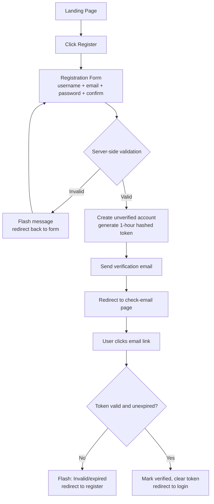
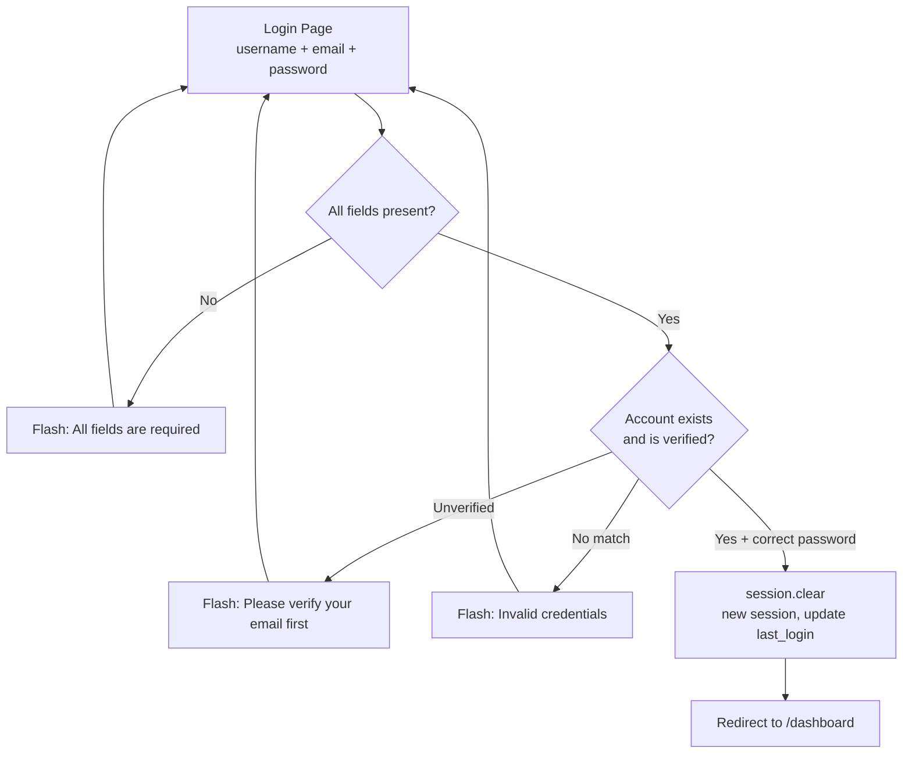
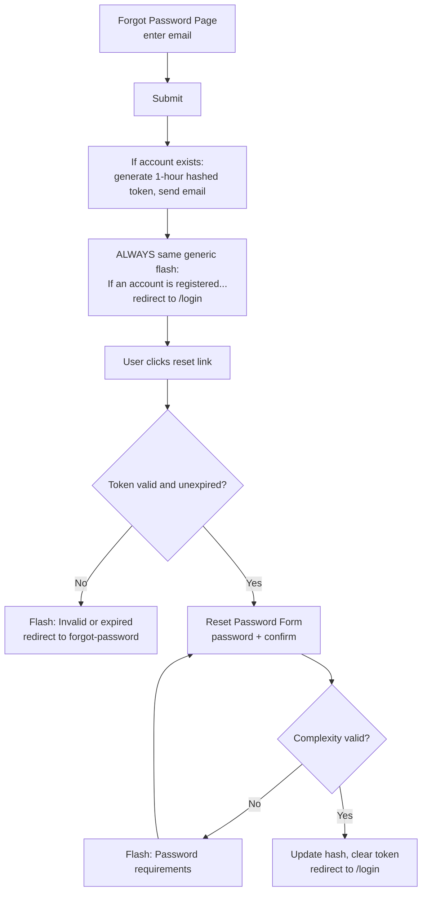
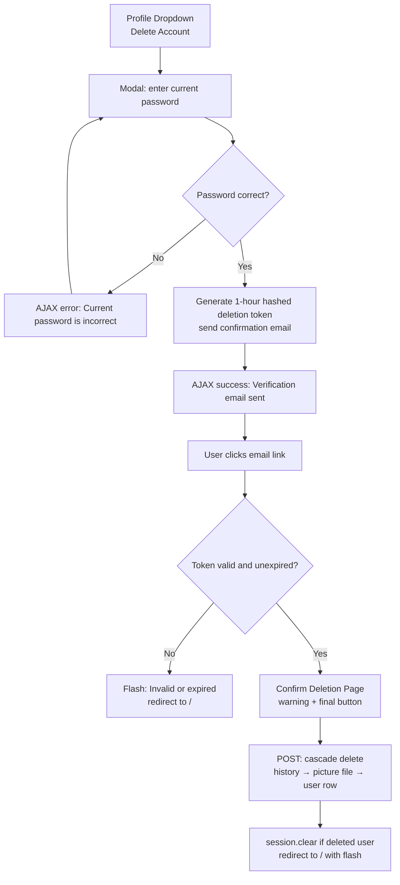
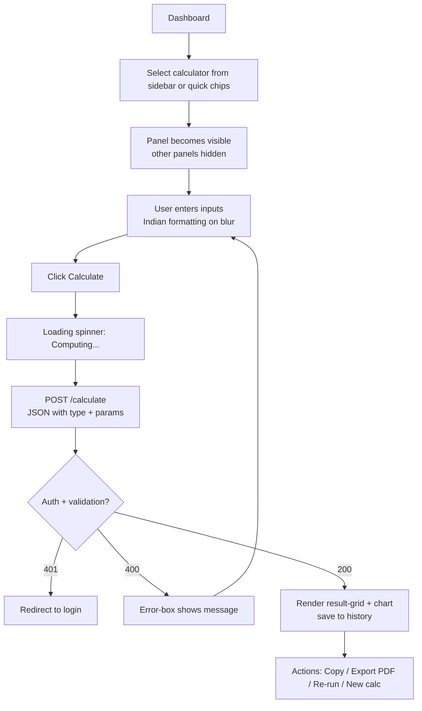
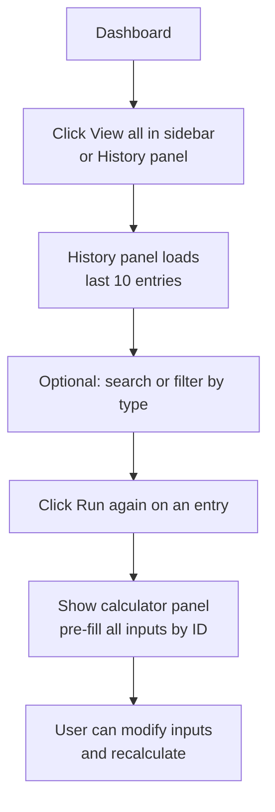
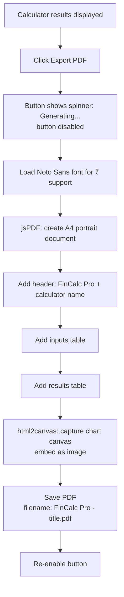

# UX Wireframes & User Flows

## FinCalc Pro — Smart Financial Calculators for India

**Version:** 2.1
**Date:** October 9, 2026
**Status:** Active
**Design Lead:** patakrishna2006-a11y

> **Scope note:** This is the **low-fi structural** reference. For high-fidelity mockups with exact colors, copy, and verified values, see [ui-mockups-prototypes.md](ui-mockups-prototypes.md).

---

## Table of Contents

1. [Design Principles](#1-design-principles)
2. [User Flow Diagrams](#2-user-flow-diagrams)
3. [Wireframe Specifications](#3-wireframe-specifications)
4. [Screen States & Interactions](#4-screen-states--interactions)
5. [Responsive Breakpoints](#5-responsive-breakpoints)
6. [Accessibility Annotations](#6-accessibility-annotations)
7. [Component Library](#7-component-library)

---

## 1. Design Principles

### 1.1 Core UX Principles (As Implemented)

| Principle | Implementation |
|-----------|----------------|
| **Clarity First** | Two-card layout: parameters left, results right |
| **Instant Feedback** | Loading spinner ("Computing…"), error-box, result-grid |
| **Error Prevention** | Server-side validation, smart placeholders, constrained selects |
| **Efficiency** | Sidebar search (`/` to focus), quick chips, re-run from history |
| **Trust** | Open formulas in code, no data selling, secure session |

### 1.2 Design System Foundation (Verified from `style.css`)

| Token | Value |
|-------|-------|
| Spacing | 4px base (4, 8, 12, 16, 24, 32, 48, 64) |
| Typography | Inter 300–900, fluid `clamp()` scale |
| Color themes | 5 themes × dark/light (10 palettes) |
| Border radius | 10px (sm), 14px (md), 20px (lg), 28px (xl), 999px (pill) |
| Shadows | soft / medium / heavy + inset |
| Transitions | 160ms fast, 280ms normal, 520ms slow, 420ms spring |
| Blur | 8px (sm), 18px (md), 28px (lg), 40px (xl) |

> Full token spec: [ui-design-color-spec.md](ui-design-color-spec.md)

---

## 2. User Flow Diagrams

### 2.1 Registration & Email Verification



### 2.2 Login Flow (3 Fields Required)



### 2.3 Password Reset Flow



### 2.4 Account Deletion Flow (Two-Step)



### 2.5 Calculator Flow



### 2.6 History & Re-run Flow



### 2.7 PDF Export Flow



---

## 3. Wireframe Specifications

### 3.1 Landing Page

```
┌─────────────────────────────────────────────────────────────────┐
│  HEADER (sticky, glass)                                          │
│  [Logo] FinCalc Pro           [Login] [Get Started →]            │
├─────────────────────────────────────────────────────────────────┤
│  HERO SECTION                                                    │
│  India's Smartest Financial Calculators                          │
│  26 accurate tools for SIP, EMI, Retirement & more              │
│  [Get Started Free]              [Watch Demo]                    │
│  [Animated phone mockup with live SIP preview]                   │
├─────────────────────────────────────────────────────────────────┤
│  CALCULATOR CATEGORIES                                           │
│  [Investments 10] [Planning 3] [Loans & EMI 6]                   │
│  [General 6] [Crypto 1]                                          │
├─────────────────────────────────────────────────────────────────┤
│  TRUST INDICATORS                                                 │
│  [Bank-grade formulas] [Instant results] [Mobile-first]         │
├─────────────────────────────────────────────────────────────────┤
│  FOOTER                                                          │
└─────────────────────────────────────────────────────────────────┘
```

### 3.2 Login Page (3 Fields)

```
┌─────────────────────────────────────────────────────────────────┐
│  BACKGROUND: animated orbs + grid overlay                        │
│  AUTH CARD (centered, glass)                                     │
│  ┌─────────────────────────────────────────────────────────────┐ │
│  │ [Logo] FinCalc Pro                    ← Back to Home        │ │
│  │                                                             │ │
│  │ USERNAME                                                    │ │
│  │ [___________________________]                               │ │
│  │                                                             │ │
│  │ EMAIL                                                       │ │
│  │ [___________________________]                               │ │
│  │                                                             │ │
│  │ PASSWORD                                            [👁]   │ │
│  │ [___________________________]                               │ │
│  │                                                             │ │
│  │ [        Sign In (full width)          ]                    │ │
│  │                                                             │ │
│  │ Forgot password? · Don't have an account? Create one →      │ │
│  └─────────────────────────────────────────────────────────────┘ │
└─────────────────────────────────────────────────────────────────┘
```

> **Note:** Login requires **all three fields** (username, email, password). There is no "username or email" combined field.

### 3.3 Registration Page

```
┌─────────────────────────────────────────────────────────────────┐
│  STEP 1: Registration Form                                       │
│  ┌─────────────────────────────────────────────────────────────┐ │
│  │ Create Account                                              │ │
│  │                                                             │ │
│  │ USERNAME                                                    │ │
│  │ [___________________________]                               │ │
│  │                                                             │ │
│  │ EMAIL                                                       │ │
│  │ [___________________________]                               │ │
│  │                                                             │ │
│  │ PASSWORD                                             [👁]  │ │
│  │ [___________________________]                               │ │
│  │                                                             │ │
│  │ CONFIRM PASSWORD                                     [👁]  │ │
│  │ [___________________________]                               │ │
│  │                                                             │ │
│  │ [   Create Free Account (full width)   ]                    │ │
│  │                                                             │ │
│  │ Already have an account? Login →                            │ │
│  └─────────────────────────────────────────────────────────────┘ │
│  STEP 2: Check Email (redirects after submit)                     │
│  ┌─────────────────────────────────────────────────────────────┐ │
│  │ Check your email                                            │ │
│  │ Verification link sent, expires in 1 hour                    │ │
│  │                                                             │ │
│  │ [Email display]         [Resend → (1 per 5 min)]            │ │
│  └─────────────────────────────────────────────────────────────┘ │
└─────────────────────────────────────────────────────────────────┘
```

### 3.4 Dashboard (Authenticated SPA)

```
┌─────────────────────────────────────────────────────────────────┐
│  HEADER (sticky, glass)                                          │
│  [☰ toggle] FinCalc Pro/Dashboard          [👤 avatar 40px]     │
├──────────────┬──────────────────────────────────────────────────┤
│  SIDEBAR     │  MAIN CONTENT                                     │
│  (280px)     │                                                    │
│              │  WELCOME                                           │
│ [🔍 Search   │  Your Financial Command Centre                    │
│  calculators]│  Select a calculator from the sidebar...         │
│              │                                                    │
│ [🌙][☀️]     │  QUICK CHIPS: [SIP] [EMI] [Retirement]           │
│  (dark/light │              [Brokerage] [CAGR] [GST]             │
│   toggle)    │                                                    │
│              │  PAGE HEADER (injected per panel)                 │
│ INVESTMENTS  │  ┌────────────────────┐ ┌──────────────────┐     │
│  SIP         │  │ Parameters card    │ │ Results card     │     │
│  Lumpsum     │  │ (form fields +     │ │ (chart + grid +  │     │
│  Step-Up SIP │  │  Calculate button) │ │  Copy + PDF btns)│     │
│  SWP         │  └────────────────────┘ └──────────────────┘     │
│  PPF         │                                                    │
│  EPF         │  HISTORY PANEL (when "View all" clicked)         │
│  NPS         │  Search + filter chips + last 10 entries          │
│  NSC         │                                                    │
│  Fixed Dep.  │                                                    │
│  Recurring   │                                                    │
│ PLANNING     │                                                    │
│  Retirement  │                                                    │
│  Inflation   │                                                    │
│  CAGR        │                                                    │
│ LOANS & EMI  │                                                    │
│  EMI         │                                                    │
│  Home Loan   │                                                    │
│  Car Loan    │                                                    │
│  Gold Loan   │                                                    │
│  Education   │                                                    │
│  Flat vs Red.│                                                    │
│ GENERAL      │                                                    │
│  Simple Int. │                                                    │
│  Compound   │                                                    │
│  GST         │                                                    │
│  Gratuity    │                                                    │
│  Salary      │                                                    │
│  Brokerage   │                                                    │
│ CRYPTO       │                                                    │
│  Converter   │                                                    │
│ RECENT       │                                                    │
│  ACTIVITY   │                                                    │
│  (last 3)    │                                                    │
│  [View all→] │                                                    │
│ ACCOUNT      │                                                    │
│  [Logout]    │                                                    │
└──────────────┴──────────────────────────────────────────────────┘
```

### 3.5 Calculator Panel (Two-Card Layout)

```
┌─────────────────────────────────────────────────────────────────┐
│  PAGE HEADER (injected per panel)                                │
│  Calculator Name (h2) · Subtitle (muted)                         │
├──────────────────────┬──────────────────────────────────────────┤
│  CARD 1: Parameters  │  CARD 2: Results                          │
│  [Badge: type]       │                                            │
│                      │  [Chart canvas (if applicable)]           │
│  Field Label         │                                            │
│  [Input with Indian  │  Result Label          Value               │
│   number format]     │  ─────────────────────────────             │
│                      │  Total Investment    ₹6,00,000.00         │
│  Field Label         │  Future Value        ₹11,50,193.45        │
│  [Input]             │  Wealth Gained        ₹5,50,193.45         │
│                      │                                            │
│  [Select dropdown    │                                            │
│   if applicable]     │  [⧉ Copy Results] [📄 Export PDF]         │
│                      │  (crypto panel: copy only, no PDF)         │
│  [ Calculate ]       │                                            │
│                      │                                            │
│  ⠋ Computing...      │                                            │
│  (loading state)     │                                            │
│                      │                                            │
│  ⚠ error-box         │                                            │
│  (server message)    │                                            │
└──────────────────────┴──────────────────────────────────────────┘
```

**Verified sample (SIP):** ₹5,000/mo @ 12% × 10y (End of Month) → Future Value **₹11,50,193.45** · Wealth Gained **₹5,50,193.45** · Total Investment **₹6,00,000.00**

### 3.6 History Panel

```
┌─────────────────────────────────────────────────────────────────┐
│  🕐 Calculation History [LAST 10] (count)  [🔍 Search calcs]     │
│  [filter chips: one per calculator type]                          │
├─────────────────────────────────────────────────────────────────┤
│  📈 SIP                    ₹11,50,193.45   (headline)             │
│     future value · ₹5,000/month · 12% · 10 years                 │
│     [↻ Run again] [⧉ copy] [🗑 delete]    08 Oct, 2:30 PM IST    │
├─────────────────────────────────────────────────────────────────┤
│  🏠 Home Loan    EMI ₹21,695.58                                  │
│     for ₹25,00,000 · 8.5% · 20 years       08 Oct, 1:02 PM      │
├─────────────────────────────────────────────────────────────────┤
│  🧾 GST          ₹1,180.00                                       │
│     total with GST · ₹1,000 · 18%           08 Oct, 11:47 AM      │
└─────────────────────────────────────────────────────────────────┘
  Empty state: italic "No history yet"
```

### 3.7 Profile Dropdown

```
┌────────────────────────────────────────────┐
│ [👤 76px avatar + 📷 camera chip]           │
│  username                                   │
│  email@example.com                         │
│  ✓ Email verified / ⚠ Email not verified   │
├────────────────────────────────────────────┤
│ 🎂 Member since     {date}                 │
│ 🕐 Last login       {date time}            │
├────────────────────────────────────────────┤
│ 🎨 Theme  [● current theme]      [chev ▼]  │
│    (expands to 5 theme options)            │
├────────────────────────────────────────────┤
│ [🔑 Change Password]                       │
│ [🧹 Remove Photo]  (hidden if no picture)  │
│ [🗑 Delete Account] (danger styling)       │
├────────────────────────────────────────────┤
│ [           Logout           ]              │
└────────────────────────────────────────────┘
```

### 3.8 Error Pages (400-500)

```
┌─────────────────────────────────────────────────────────────────┐
│  BACKGROUND: orbs + grid                                         │
│  CENTERED GLASS CARD                                             │
│  ┌───────────────────────────────────────────────────────────┐  │
│  │  [Icon]                                                    │  │
│  │  {Error Code} · {Error Title}                              │  │
│  │  {Description}                                              │  │
│  │  [Return Home →]                                            │  │
│  └───────────────────────────────────────────────────────────┘  │
└─────────────────────────────────────────────────────────────────┘
  Available: 400, 401, 403, 404, 405, 413, 429 (shows countdown), 500
```

---

## 4. Screen States & Interactions

### 4.1 Calculator States

| State | Visual | Trigger |
|-------|--------|---------|
| **Empty (welcome)** | Welcome message + quick chips | Initial load |
| **Panel visible** | Parameters card + empty results card | Calculator selected |
| **Loading** | Spinner + "Computing..." | Calculate clicked |
| **Results** | Populated result-grid + chart | Success response |
| **Error** | Error-box below Calculate button | 400 response |
| **Re-running** | Loading state overwrites previous results | Calculate with existing results |

### 4.2 Input States (Verified from `style.css`)

| State | Border | Fill | Shadow |
|-------|--------|------|--------|
| **Default** | `--border-glass` (rgba(255,255,255,0.10)) | `--surface` | inset depth |
| **Hover** | `--border-glass-strong` | `--surface-glass` | — |
| **Focus** | `rgba(108,140,255,0.70)` | `--surface-glass` | 4px ring + glow |
| **Error** | danger border + error-box below | — | — |

### 4.3 Chart Interactions

| Interaction | Behavior |
|-------------|----------|
| **Hover** | Tooltip with values |
| **Click legend** | Toggle series visibility |
| **Resize** | Responsive (Chart.js built-in) |
| **Export** | Chart canvas captured via html2canvas → embedded in PDF |

### 4.4 Toast Notifications

| Type | Border Color | Auto-dismiss | Examples |
|------|-------------|--------------|----------|
| **Success** | `rgba(46,229,157,0.45)` | 3.5s | "Verification email sent!" · "Successful login!" |
| **Danger** | `rgba(255,92,122,0.45)` | 3.5s* | "Invalid credentials" · "Security token expired..." |
| **Warning** | `rgba(255,180,84,0.45)` | 3.5s* | "Please verify your email first..." |
| **Info** | `rgba(108,140,255,0.45)` | 3.5s | "If an account is registered with that email..." |

*All toasts auto-dismiss at 3.5s via the inline JS `setTimeout`. The danger/warning colors differ but dismissal is uniform.

---

## 5. Responsive Breakpoints (Verified — 45/45 Tests Pass)

### 5.1 Layout Adaptations

| Breakpoint | Sidebar | Calculator Layout | Notes |
|------------|---------|-------------------|-------|
| **≤360px** | Hamburger drawer + scrim | 1 column (form above results) | Orbs scaled down |
| **361-767px** | Hamburger drawer | 1 column | — |
| **768-1023px** | Hamburger drawer (never pins) | 1-2 columns | — |
| **≥1024px** | Pinned 280px | 2 cards side-by-side | Two-card layout |
| **≥1920px** | Pinned 280px | 2 cards, content capped at 1280px | `--max-width: 1280px` |

### 5.2 Component Behavior

| Component | Mobile (<768px) | Desktop (≥1024px) |
|-----------|-----------------|-------------------|
| Sidebar | Drawer + scrim, slide-in 280ms | Pinned, always visible |
| Form grid | 1 column | `auto-fit minmax(220px, 1fr)` |
| Charts | Full width, below results | ~40% width, beside results |
| Modals | Compact | ~420-500px max-width |
| Toasts | top: 24px, right: 24px | same |
| Orbs | Scaled down (320/360/480 rules) | Default size |

---

## 6. Accessibility Annotations

### 6.1 WCAG 2.1 AA Compliance (Verified)

| Criterion | Implementation |
|-----------|----------------|
| **1.1.1 Non-text Content** | Icons have `aria-label` or `aria-hidden` |
| **1.3.1 Info & Relationships** | Semantic HTML5, heading hierarchy |
| **1.4.3 Contrast** | ≥4.5:1 body text, ≥3:1 large text (verified in all 10 palettes) |
| **1.4.11 Non-text Contrast** | ≥3:1 for UI components, focus indicators |
| **2.1.1 Keyboard** | All functionality keyboard accessible |
| **2.1.2 No Keyboard Trap** | Esc closes modals/drawers/dropdowns |
| **2.4.7 Focus Visible** | 2px outline, 3px offset, `--accent-primary` |
| **3.3.1 Error Identification** | Error-box with `role="alert"` |
| **3.3.2 Labels** | All inputs have `<label>` elements |
| **4.1.2 Name, Role, Value** | ARIA roles on custom components |

### 6.2 ARIA Implementation (Verified from Templates)

| Component | ARIA |
|-----------|------|
| Sidebar nav | `aria-label="Calculator navigation"` |
| Search input | `aria-label="Search calculators"` |
| Toast | `role="alert"`, `aria-live="assertive"` |
| Profile dropdown | `role="menu"`, `aria-haspopup="true"`, `aria-expanded` |
| Theme options | `role="menuitemradio"`, `aria-checked` |
| Calculator panels | `aria-live="polite"` on page-header |
| History list | `aria-live="polite"` |
| Modals | `role="dialog"`, `aria-modal="true"`, `aria-labelledby` |
| Password toggles | `aria-label="Toggle password visibility"`, `aria-pressed` |
| Scheme toggle | `role="group"`, `aria-label="Color scheme"` |

### 6.3 Keyboard Navigation (Verified from JS)

| Key | Action |
|-----|--------|
| **Tab / Shift+Tab** | Next / previous focusable |
| **Enter / Space** | Activate buttons |
| **Esc** | Close modal/drawer/dropdown; clear search if focused |
| **/** | Focus calculator search input |
| **Arrow keys** | Navigate theme options (menuitemradio) |

---

## 7. Component Library (Verified)

### 7.1 Core Components

| Component | Variants | States | Location |
|-----------|----------|--------|----------|
| **Button** | `btn-primary` (gradient), `btn-secondary` (glass), `btn-outline`, `btn-auth` (full-width gradient), `btn-calc` (indigo→teal gradient, dark text `#051020`), danger | default, hover (lift −3px + glow), active (press +1px), focus-visible (2px outline), loading (spinner + disabled) | `style.css` |
| **Input** | text (with `inputmode="numeric"`), password (with eye toggle), select (with CSS chevrons), search | default, hover, focus, error | `style.css` |
| **Card** | `.card` (glass), `.calc-panel > .card` | default, hover (lift −6px + glow) | `style.css` |
| **Modal** | `.logout-modal-backdrop > .logout-modal` | closed → entering → open → exiting | `index.html` |
| **Drawer** | `.sidebar` + `.sidebar-overlay` | closed → open (slide-in) → closed | `index.html` |
| **Toast** | `.toast-msg.success/.danger/.warning/.info` | enter (slide-in-right spring 380ms) → visible 3.5s → exit (fade 400ms) | `index.html` |
| **Badge** | `.badge` (gradient wash, uppercase) | default | `style.css` |
| **Avatar** | `.profile-avatar` (gradient circle, initials or image), `.profile-avatar-xl` (76px) | default, uploading (spinner overlay) | `style.css` + `index.html` |
| **Chart** | Chart.js canvas | empty (hidden), populated (with animation), responsive | `index.html` inline JS |
| **Spinner** | `.spinner` (rotating circle) | infinite 800ms linear | `style.css` |

### 7.2 Calculator-Specific Patterns

| Pattern | Description |
|---------|-------------|
| **Two-card layout** | Parameters card (left/bottom) + Results card (right/top) |
| **Input ID convention** | `{TYPE}-{Param Name}` (e.g. `SIP-Monthly investment`) for JS param collection and history re-run |
| **Result actions** | Copy Results (flips to "Copied!") + Export PDF (spinner "Generating..."); Crypto panel has copy-only |
| **History entry** | Icon + calc name + headline + label + summary + timestamp + Run again/copy/delete buttons |
| **Theme picker** | Expandable submenu with 5 radio options (menuitemradio), checkmark on active |

---

**Document Control**

| Version | Date | Author | Changes |
|---------|------|--------|---------|
| 2.1 | Oct 9, 2026 | patakrishna2006-a11y | Accuracy pass: 26 UI calculators (27 backend), 3-field login, verified SIP value ₹11,50,193.45, real PDF filename, correct token names, removed non-existent elements (password meter, Annualized Return row, chart X-axis labels), per-IP rate limits |
| 2.0 | Oct 8, 2026 | patakrishna2006-a11y | Updated for security hardening + responsive overhaul |
| 1.0 | Oct 8, 2026 | patakrishna2006-a11y | Initial release |

---

**Approval**

| Role | Name | Signature | Date |
|------|------|-----------|------|
| Design Lead | patakrishna2006-a11y | patakrishna2006-a11y | October 9, 2026 |
| Product Owner | patakrishna2006-a11y | patakrishna2006-a11y | October 9, 2026 |
| Engineering Lead | patakrishna2006-a11y | patakrishna2006-a11y | October 9, 2026 |
| Accessibility Reviewer | patakrishna2006-a11y | patakrishna2006-a11y | October 9, 2026 |

---

*End of UX Wireframes & User Flows Document*
